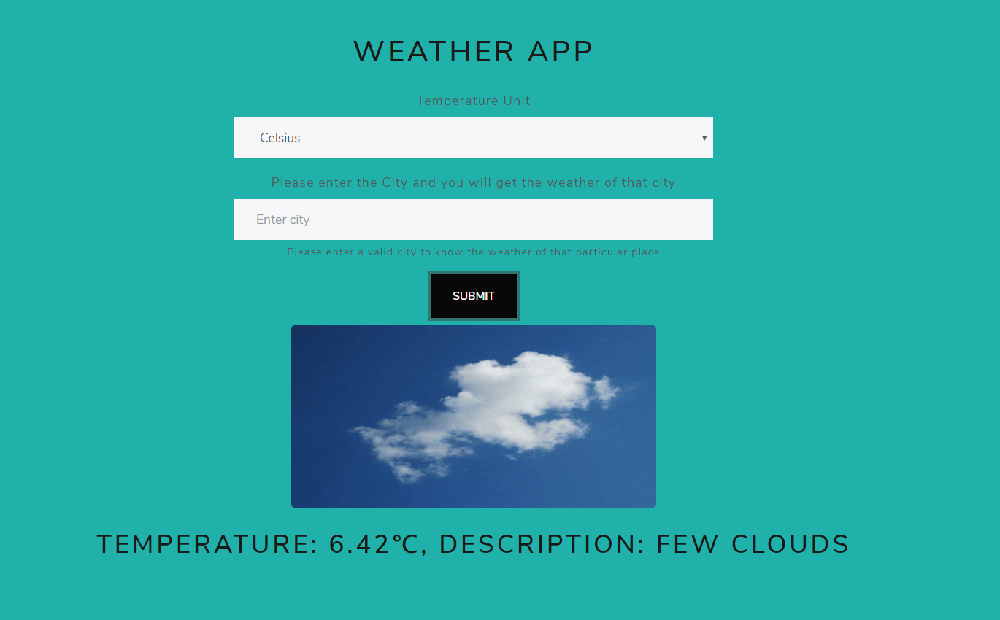

# Weather App

> Weather App is a web app that lets you use the Open Weather Map API to fetch real-time weather information for any location worldwide.

## Built With

- HTML5
- CSS3
- Javascript
- Webpack

## Live Demo

[Live Demo Link](https://danielmitiku.github.io/weather-app)

## Screenshot




## Getting Started

To get a local copy up and running follow these simple example steps.

 - Clone this repository to your local machine using ```git clone git@github.com:danielmitiku/weather-app.git```.

 - Run ```cd weather-app``` to move into the app directory.

 - Open the ```dist/index.html``` file in your browser.
 
 ## Current Features

- Fetch weather info from Open Weather Map API.
- Fetch weather giphy from Giphy API

## Features you can add

- Update the UX and UI for better experience

## Author

👤 **Daniel Mitiku**

- Github: [@danielmitiku](https://github.com/DanielMitiku)
- LinkedIn: [@daniel-wesego](https://www.linkedin.com/in/daniel-wesego/)
- Email: wedanielmitiku@gmail.com

## 🤝 Contributing

- Contributions, issues and feature requests are welcome!

- Feel free to create PR.

## Show your support

- Give a ⭐️ if you like this project and follow me on [Github](https://github.com/DanielMitiku) for more projects like this.

## 📝 License

This project is [MIT](http://www.tldrlegal.com/license/mit-license) licensed.
